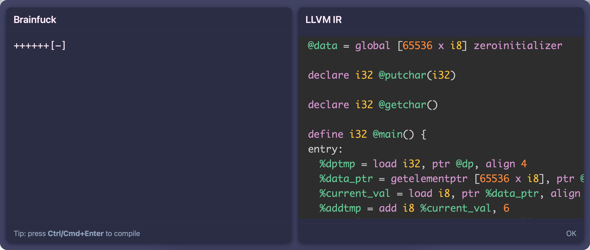

# Brainf*ck to LLVM IR Compiler Frontend

A compiler frontend for the [Brainf*ck language](https://en.wikipedia.org/wiki/Brainfuck) that outputs code in LLVM Intermediate Representation (IR), which can then be compiled to any desired target architecture with `clang`.

You can interact with it online [here](https://benmandrew.com/articles/compiler-frontend), or in a self-hosted web interface accessed at [`http://localhost:8080`](http://localhost:8080) after running
```bash
$ docker compose up
```

The input validation and parsing is mathematically proven correct for `bf` programs up to eight commands long using the [C Bounded Model Checker](https://github.com/diffblue/cbmc) (CBMC). Details are [here](#model-check-memory-safety).



## Dependencies

#### Ubuntu/Debian
```bash
$ sudo apt-get install cmake llvm-dev check expect clang-format cpplint
```

#### MacOS (Homebrew)
```bash
$ brew install cmake llvm check expect clang-format cpplint
```

## Building

```bash
$ cmake -B build
$ cmake --build build
```

After building, the `bfc` (compiler) and `bfi` (interpreter) executables will be in the `build` directory.

To compile a `bf` program to a binary executable:

```bash
# Generate LLVM IR
$ ./build/bfc test/res/helloworld.b > main.ll
# Compile IR to binary
$ clang main.ll -o main
$ ./main
Hello, World!
```

To execute a `bf` program with the interpreter:

```bash
$ ./build/bfi test/res/helloworld.b
Hello, World!
```

### Formatting and Linting

```bash
$ cmake --build build --target fmt lint
```

### Tests

```bash
$ cmake --build build --target tests
```

### Fuzzing

You can fuzz test with AFL:

```bash
$ docker run -ti -v .:/src benmandrew/bf:fuzz
```

If there are crashes, the offending inputs will be located in `build-fuzz/fuzz_output/default/crashes`.

### Model-check memory safety

Use the [C Bounded Model Checker](https://github.com/diffblue/cbmc) (CBMC) to prove the memory safety of the input validation and parsing for all programs up to a maximum program length:

```bash
$ cmake --build build --target cbmc
$ ./scripts/cbmc_run.sh [MAX_PROGRAM_LEN]
```

The memory usage and running time of the model checker increase exponentially with `MAX_PROGRAM_LEN`, so start small, e.g. 4.

## FAQ

> Why does ASan fail with `malloc: nano zone abandoned due to inability to reserve vm space.`?

On MacOS, every ASan-built binary prints this error. This is not an issue with the program, and can be fixed by setting the environment variable `MallocNanoZone=0`. See https://github.com/google/sanitizers/issues/1666.

## Useful Links for Learning the LLVM Intermediate Representation

Compiling to the LLVM IR is a niche topic, and it is hard to find resources for learning. Here are a few useful ones I found:

- *Mapping High Level Constructs to LLVM IR* ([link](https://mapping-high-level-constructs-to-llvm-ir.readthedocs.io/en/latest/))
- *A Complete Guide to LLVM for Programming Language Creators* ([link](https://mukulrathi.com/create-your-own-programming-language/llvm-ir-cpp-api-tutorial/))
- *My First Language Frontend with LLVM Tutorial* ([link](https://llvm.org/docs/tutorial/MyFirstLanguageFrontend/))
