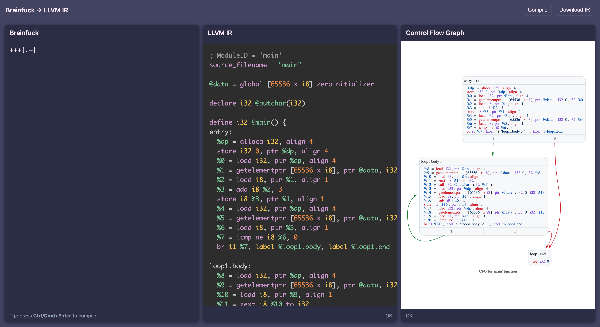

# Brainf*ck to LLVM IR Compiler Frontend

A compiler frontend for the [Brainf*ck language](https://en.wikipedia.org/wiki/Brainfuck) that outputs code in LLVM Intermediate Representation (IR), which can then be compiled to any desired target architecture with `clang`.

You can interact with it online [here](https://benmandrew.com/articles/compiler-frontend), or in a self-hosted web interface accessed at [`http://localhost:8080`](http://localhost:8080) after running

```bash
$ docker compose up
```

The input validation and parsing functionality is formally verified to be memory safe for inputs up to thirteen commands long. Details are in [MODELCHECKING.md](MODELCHECKING.md).



## Dependencies

The project ships a [Nix flake](https://nixos.wiki/wiki/Flakes) with a devShell providing every tool the build needs — cmake, LLVM/clang, `check`, `expect`, `clang-format`, `cpplint`, Doxygen, Graphviz, Python/Sphinx, `shfmt`, and `shellcheck` — pinned via `flake.lock` for reproducibility. This is what CI uses, and is the recommended way to build locally:

```bash
$ nix develop
```

Every command in this README can be run unmodified inside that shell.

A `.envrc` is checked in, so with [direnv](https://direnv.net/) the shell loads on entering the directory — `direnv allow` once, and `nix develop` becomes unnecessary. Installing [nix-direnv](https://github.com/nix-community/nix-direnv) alongside it is worthwhile: it caches the shell so re-entry is instant and stops the garbage collector from reclaiming the dependencies.

<details>
<summary>Manual install (alternative to Nix)</summary>

#### Ubuntu/Debian
```bash
$ sudo apt-get install cmake llvm-dev check expect clang-format cpplint doxygen graphviz
```

#### MacOS (Homebrew)
```bash
$ brew install cmake llvm check expect clang-format cpplint doxygen graphviz
```

</details>

## Building

```bash
$ cmake -B build
$ cmake --build build
```

After building, the `bfc` (compiler) and `bfi` (interpreter) executables will be in the `build` directory.

To compile a `bf` program to a binary executable:

```bash
# Generate LLVM IR
$ bfc test/res/helloworld.b > main.ll
# Compile IR to binary
$ clang main.ll -o main
$ ./main
Hello, World!
```

To execute a `bf` program with the interpreter:

```bash
$ bfi test/res/helloworld.b
Hello, World!
```

### Visualising the Control Flow Graph

Basic blocks are named after the loop that creates them (`loop6.body`, `loop6.end`). Passing `--label-blocks` additionally appends the span of Brainf*ck source each block covers, which is enough to read a *control flow graph* (CFG) back against the original program:

```bash
$ scripts/cfg.sh test/res/fib.b                 # writes cfg.png
$ scripts/cfg.sh -o fib_cfg.svg test/res/fib.b  # extension picks the format
```

The script chains `bfc --label-blocks` into `opt -passes=dot-cfg-only` into `dot`, theming the graph on the way through. `-b` selects the build directory (default `build`) and `-o` the output file, which must end in `.png` or `.svg`. Passing `-i` switches `opt` to `-passes=dot-cfg`, which prints each block's instructions in full and syntax-highlights them. Both `opt` and `dot` come from the Nix devShell.

Highlighting is why the theming lives in `scripts/highlight.py` rather than in a `sed` expression. A record label cannot carry per-token colour, so the script rewrites each one into a Graphviz *HTML-like label*: a table whose body rows are coloured token by token, and whose final row keeps the `<s0>` and `<s1>` ports that the branch edges attach to. The token rules are a port of [Prism](https://prismjs.com/)'s LLVM grammar, so a graph highlights the same way as LLVM IR rendered by Prism elsewhere. The port carries one deliberate divergence. Prism's LLVM component predates opaque pointers and has no rule for `ptr`, leaving its catch-all keyword rule to claim it, which colours `ptr` as though it were `store` or `align`. `bfc` emits opaque pointers throughout, so `highlight.py` adds `ptr` to the type rule. Across the 730 distinct instructions the test programs emit, that is the only disagreement between the two tokenisers.

Theming needs one non-obvious flag. LLVM's CFG printer enables *heat colours* by default, shading each block by its execution frequency. Absent profile-guided optimisation (PGO) data every block carries the same default weight, so the shading encodes nothing while looking like it does. Worse, it is emitted inline on every node, and inline attributes beat `dot`'s `-N` and `-E` defaults, so the graph cannot be restyled at all. Passing `-cfg-heat-colors=false` drops the inline `color`, `fillcolor` and `fontname`, which frees the script to apply rounded nodes, a mono font, and edges coloured green for the true branch and red for the false one. Colouring by branch is what makes a loop back-edge legible at a glance.

Two caveats, one of which the script now enforces. `opt` must match the LLVM version `bfc` was built against, so `cfg.sh` compares the two and refuses to run on a mismatch. That check earns its keep: a system `opt` shadowing the devShell may parse the opaque-pointer output with only a warning, then emit a graph that looks plausible and is wrong. The other caveat is that `--label-blocks` is best left off `-O`, since the `simplifycfg` pass merges and renames blocks, degrading the labels until the graph no longer mirrors the source. The script therefore omits `-O` unless asked with its own `-O` flag.

Loops that `optimise_program()` rewrites into `CMD_CLEAR` or `CMD_MULTIPLY` lower to straight-line code and so contribute no blocks. They appear inside a label as `[-]` and `[mul]` respectively. This rewriting is unconditional, which is why `helloworld.b` graphs as a single block.

### Formatting and Linting

```bash
$ cmake --build build --target fmt lint
```

The C sources go through clang-format and cpplint. The shell and Python under `scripts/` and `verification/` go through `shfmt -i 4 -ci`, `shellcheck` and `ruff`, which `cmake/scripts.cmake` attaches to the same `fmt`, `fmt-ci` and `lint` targets. Every one of those tools comes from the devShell and is invoked by name rather than searched for, so a build outside `nix develop` that is missing one fails on it rather than skipping it silently.

### Documentation

Code docs can be accessed online at [benmandrew.com/docs/bf/](https://benmandrew.com/docs/bf/), or built locally with

```bash
$ cmake --build build --target docs
```

Depends on Doxygen and Sphinx, both provided by the Nix devShell. The generated HTML site is written to `build/docs/html/index.html`.

### Tests

```bash
$ cmake --build build --target tests
```

### Fuzzing

You can fuzz test with AFL:

```bash
$ docker run -ti -v .:/src benmandrew/bf:fuzz
```

If there are crashes, the offending inputs will be located in `build-fuzz/fuzz_output/default/crashes`.

## FAQ

> Why does ASan fail with `malloc: nano zone abandoned due to inability to reserve vm space.`?

On MacOS, every ASan-built binary prints this error. This is not an issue with the program, and can be fixed by setting the environment variable `MallocNanoZone=0`. See https://github.com/google/sanitizers/issues/1666.

## Useful Links for Learning the LLVM Intermediate Representation

Compiling to the LLVM IR is a niche topic, and it is hard to find resources for learning. Here are a few useful ones I found:

- *Mapping High Level Constructs to LLVM IR* ([link](https://mapping-high-level-constructs-to-llvm-ir.readthedocs.io/en/latest/))
- *A Complete Guide to LLVM for Programming Language Creators* ([link](https://mukulrathi.com/create-your-own-programming-language/llvm-ir-cpp-api-tutorial/))
- *My First Language Frontend with LLVM Tutorial* ([link](https://llvm.org/docs/tutorial/MyFirstLanguageFrontend/))
